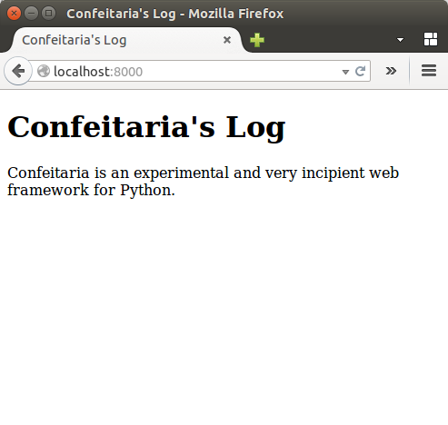
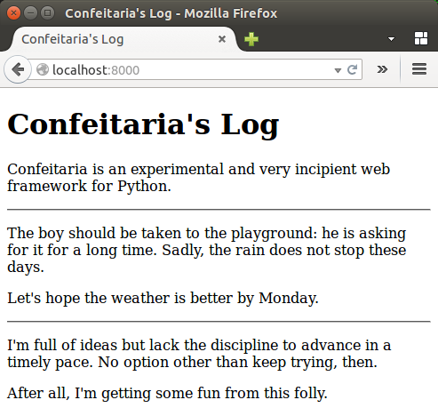
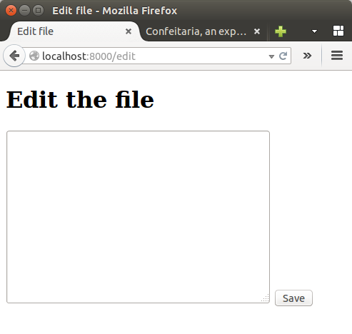
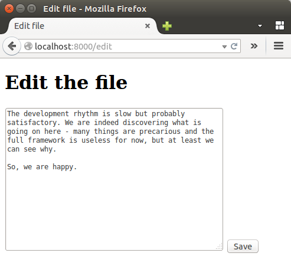

=====================================================
Confeitaria, an experimental web framework for Python
=====================================================

.. image:: https://img.shields.io/badge/maintained%3F-no!-red.svg?style=flat

Confeitaria is a Web framework for Python whose main purpose is to test some
hypothesis and possibilities about Web development. They can work or not but we
will only discover by trying, right?

Anyway, this is just a first release of the very core of it - we have to do much
more. Yet, you can already play with it. Here is how...

Installing Confeitaria
======================

You can install Confeitaria with ``pip``::

    $ pip install confeitaria

It should be possible to download the full package and unzip it but it is not
yet documented.

Creating and serving pages
==========================

In Confeitaria, the content is served from *pages*  - objects providing methods
to respond to HTTP requests. The most crucial page method is probably
``index()``. For example, suppose you want to serve the HTML document below,
which comes from the ``index.html`` file::

    <!doctype html>
    <html>
        <head>
            <title>Confeitaria's Log</title>
        </head>
        <body>
            <h1>Confeitaria's Log</h1>
            
Confeitaria is an experimental and very incipient web framework
            for Python.

        </body>
    </html>

We should create a page object such as the one below at a file named
``page.py``::

    class LogPage(object):
        def index(self):
            content = open('index.html').read()

            return content

To run it, we can use the ``confeitaria.runner.run()`` function. So our
``page.py`` file will look like this::

    import confeitaria.runner

    class LogPage(object):
        def index(self):
            content = open('index.html').read()

            return content

    page = LogPage()
    confeitaria.runner.run(page)

To run it, we just call::

    $ python page.py

Now, we just hit http://localhost:8000. There is our document:

Kneading HTML
=============

Now, we are going to store some small chunks of text into files in the same
directory. For example, one would be ``20150623183351.txt`` with the following
content::

    I'm full of ideas but lack the discipline to advance in a timely pace. No
    option other than keep trying, then.

    After all, I'm getting some fun from this folly.

Other would be ``20150623183710.txt`` and its content would be::

    The boy should be taken to the playground: he is asking for it for a long
    time. Sadly, the rain does not stop these days.

    Let's hope the weather is better by Monday.

We want to list such content in the very same HTML document - without changing
the original file. A solution would be::

    class LogPage(object):
        def index(self):
            logs = []
            for l in glob.glob('*.txt'):
                log = open(l).read()
                paragraphs = log.split('\n\n')
                marked_paragraphs = ('
{0}
'.format(p) for p in paragraphs)
                marked_log = ''.join(marked_paragraphs)

                logs.append(marked_log)

            content = open('index.html').read()
            beginning, end = content.split('</body>')

            log_content = '
' + '
'.join(logs)

            return beginning  + log_content + '</body>' + end

    page = LogPage()
    confeitaria.runner.run(page)

Below is the screenshot of the resulting page:

Note that not only we do not use any template system - we also retrieve the
content from a raw (but valid) HTML file. This is a pattern that should be used
more often: instead of using specific languages to generate markup, we get a
complete, representative HTML file and process it. Sadly, the tools available
now are quite limited but it is part of our work to improve it.

Subpages
========

Now, how to allow new logs to be entered? We can create a *subpage* to save
them. So, for example, we would create a page class like this one::

    class EditPage(object):
        def index(self):
            return """<!doctype html>
            <html>
                <head>
                    <title>Edit file</title>
                </head>
                <body>
                    <h1>Edit the file</h1>
                    <form action="/edit" method="post">
                        <textarea name="content" rows="15" cols="50"></textarea>
                        <input type="submit" value="Save">
                    </form>
                </body>
            </html>"""

(The HTML documet is in a string for pure laziness.)

We want it to be a subpage of our main page, so we add it as a field of our
index page::

    page = LogPage()
    page.edit = EditPage()
    confeitaria.runner.run(page)

We stop and start our server again with the command above (which is boring so
may be reviewed at the future...) and then access http://localhost:8000/edit.
The result is this:

The trick here is: when you assign a page object as an attribute of another page
object, it becomes a *subpage* of the later. To reach the subpage, you just need
to add the attribute names as components of the path. In our case, the attribute
name is ``edit`` so we added it after http://localhost:8000.

Executing actions
=================

Our new subpage cannot save the content yet: it has only an *index* method,
which only serves a document. We need an *action* method. Fortunately, it is
easy to do::

    class EditPage(object):
        def index(self):
            content = open('index.html').read()

            return """<!doctype html>
            <html>
                <head>
                    <title>Edit file</title>
                </head>
                <body>
                    <h1>Edit the file</h1>
                    <form action="/edit" method="post">
                        <textarea name="content" rows="15" cols="70">{content}</textarea>
                        <input type="submit" value="Save">
                    </form>
                </body>
            </html>""".format(content=content)

        def action(self, content='No content provided'):
            now = datetime.datetime.now()
            filename = now.strftime("%Y%m%d%H%M%S.txt")

            with open(filename, 'w') as log:
                log.write(content)

Quite straightforward: one gets the value of the fields as arguments to a method
called ``action()``. As you can see in the document from the index method, the
action of the form is ``/edit``, so the same page object handles the form and
the processing.

HTTP Responses
==============

Now, let's enter the following text at the form and click in "Save":

Well, you'll see that the same page with the form is displayed, but if you
reload it the form will not be resubmited. Action methods by default redirect
to their own pages by default - then if the page has an index method (as ours
does) it will be rendered.

We can, however, redirect elsewhere - just raise the
``confeitaria.responses.SeeOther`` exception. We can, for example, redirect to
the index page::

        def action(self, content='No content provided'):
            now = datetime.datetime.now()
            filename = now.strftime("%Y%m%d%H%M%S.txt")

            with open(filename, 'w') as log:
                log.write(content)

            raise confeitaria.responses.SeeOther(location='/')

If you enter a new log message, the browser will be automatically redirected to
the root page.

There are other responses to raise (e.g. ``NotFound``) as well but not all HTTP
responses are implemented yet.

Summary
=======

There is many other features available - sessions, request objects, cookies etc.
- and many others to implement. You may take a look at the `main reference`_ for
more about the framework. 

.. _`main reference`: confeitaria/doc/index.rst
